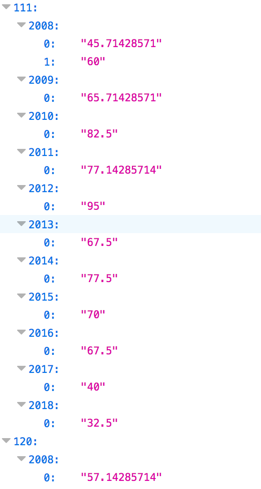
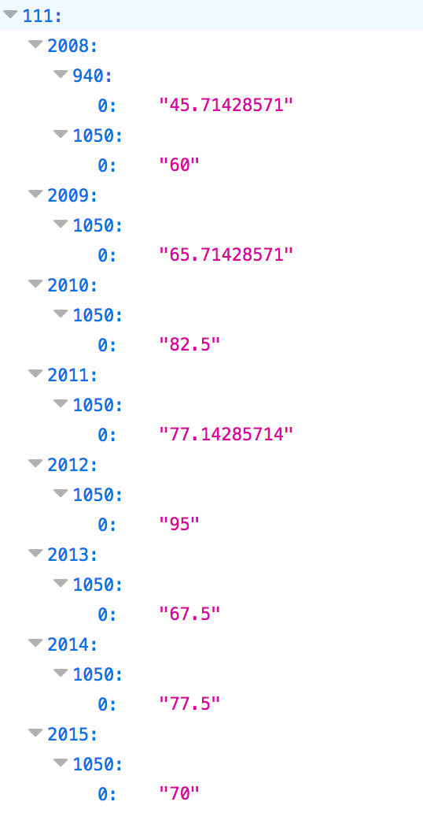
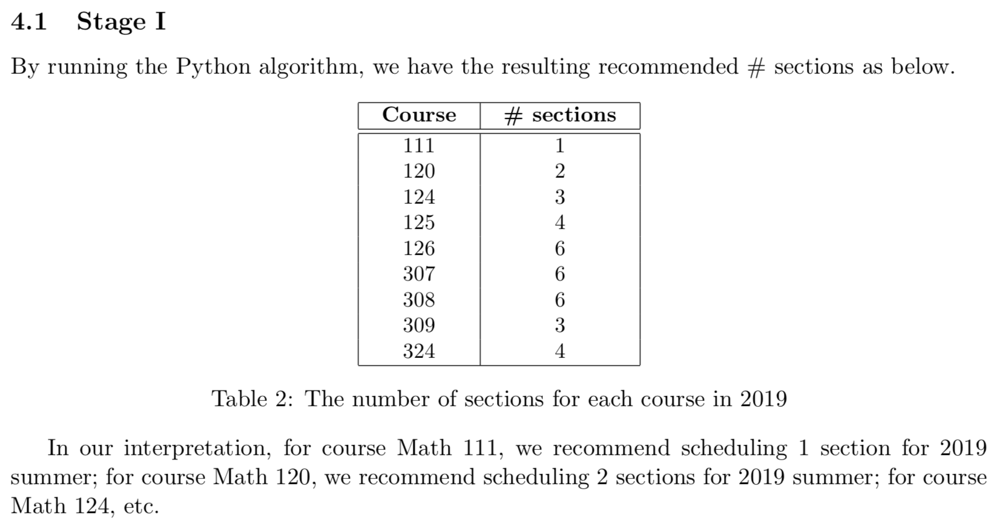
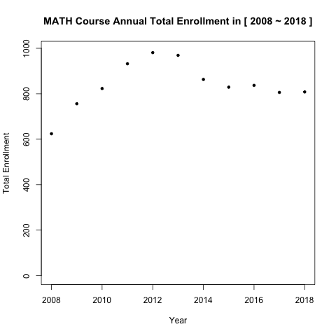
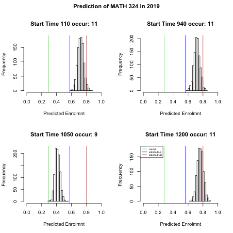

# [Solving UW Math Summer Scheduling Problem](https://mathsummerproject.github.io/MathSummerScheduling/)

Scheduling non-major summer courses for MATH 381 group project at UW.

<div>
  <p><b>Abstract</b></p>
  <p>
  Based on our interview with Sarah Garner, director of the Math Department’s Advising
  office, we will address the decision problem of finding an appropriate number of sections of
  each course in the 100 to 300 level category. The threshold for opening a section, having at
  least 10 out of 35 student enrollments. In this paper, we first present the problem description
  and its impacts. Then, we model the problem and solve it with the linear programming,
  simulation and statistical analysis. Finally, with limited resources, such as required number
  of students for a open class, we offer appropriate time schedules of sections for 9 non-major
  service courses based on historical data.
  </p>
  <p>
    <b>Keywords:</b> Mathematical model;  Monte Carlo Simulation;  Statistical Analysis;  Linear Pro-gramming; Course schedule
   </p>
</div>

## Team members Info
- Yanmeng (Anny) Kong [@AnnyKong](https://github.com/AnnyKong)
- Linni Cai [@cai20170929](https://github.com/cai20170929)

## Scripts Info
- Stage I: Python scripts for Linear Programming, reading data, and tables.
- Stage II: R scripts for Monte Carlo Simulation, diagrams and priority queue.
  
### Read csv data - Stage I
- read csv
- generate a dictionary for storing all necessary data

### Generate customized table - Stage I
An example of Math 120 table would look like the following:
```
Math 120
  year  Percent. Enrollment sec 1    Percent. Enrollment sec 2    Percent. Enrollment sec 3
------  ---------------------------  ---------------------------  ---------------------------
  2008  57.14(1050✓)                 71.43(940✓)                  77.14(1200✓)
  2009  72.00(1050✓)                 88.00(940✗)                  104.00(1200✗)
  2010  60.00(1200✓)                 74.29(1050✓)
  2011  85.71(1050✗)                 97.14(1200✗)
  2012  42.86(1050✗)                 74.29(1200✓)                 80.00(940✓)
  2013  62.86(1050✓)                 63.33(1200✓)
  2014  28.57(1050✗)                 74.29(1200✓)
  2015  91.43(1200✗)
  2016  85.71(1200✗)
  2017  88.57(1200✗)
  2018  100.00(1200✗)
```
Notes: 
- - check mark(✓) if the percentage within the preferred range (57% - 80%)
  - cross mark(✗) otherwise
  
- `(1050✓)` means 
  - the class was scheduled at 1050am;
  - and the percentage of enrollment is in the preferred range.
  

## Output files - Stage I (better open with firefox)
  - `data.json` gives 
  
    ```
    course num -> year -> percentage of enrollment
    ```
    which is dict -> dict-> list
    
    - i.e.
    <p align="center">
      
    </p>
  
  - `data2.json` gives
  
    ```
    course num -> year -> time -> percentage of enrollment
    ```
    which is dict -> dict -> dict -> list
    
    - i.e.
    <p align="center">
      
    </p>
    
## Command line Outputs - Stage I

  - i.e.
  ```
  Math 124
    year  Percent. Enrollment sec 1    Percent. Enrollment sec 2    Percent. Enrollment sec 3    Percent. Enrollment sec 4
  ------  ---------------------------  ---------------------------  ---------------------------  ---------------------------
    2008  51.42857143(✗)               62.85714286(✓)               77.14285714(✓)
    2009  40(✗)                        62.85714286(✓)               71.42857143(✓)               85.71428571(✗)
    2010  57.14285714(✓)               71.42857143(✓)               74.28571429(✓)               94.28571429(✗)
    2011  53.33333333(✗)               70(✓)                        76.66666667(✓)               80(✓)
    2012  77.14285714(✓)               85.71428571(✗)               91.42857143(✗)               100(✗)
    2013  25.71428571(✗)               54.28571429(✗)               57.14285714(✓)               71.42857143(✓)
    2014  34.28571429(✗)               48.57142857(✗)               65.71428571(✓)               88.57142857(✗)
    2015  46.66666667(✗)               73.33333333(✓)               76.66666667(✓)               76.66666667(✓)
    2016  80(✓)                        85.71428571(✗)               88.57142857(✗)
    2017  45.71428571(✗)               82.85714286(✗)               85.71428571(✗)
    2018  51.42857143(✗)               57.14285714(✓)               57.14285714(✓)
  ```
    

  - i.e.
  ```
  Math 124
  year  Percent. Enrollment sec 1    Percent. Enrollment sec 2    Percent. Enrollment sec 3    Percent. Enrollment sec 4
------  ---------------------------  ---------------------------  ---------------------------  ---------------------------
  2008  51.43(110✗)                  62.86(940✓)                  77.14(1200✓)
  2009  40.00(110✗)                  62.86(940✓)                  71.43(1200✓)                 85.71(1050✗)
  2010  57.14(1050✓)                 71.43(940✓)                  74.29(1200✓)                 94.29(110✗)
  2011  53.33(110✗)                  70.00(940✓)                  76.67(1050✓)                 80.00(1200✓)
  2012  77.14(110✓)                  85.71(1050✗)                 91.43(1200✗)                 100.00(940✗)
  2013  25.71(110✗)                  54.29(1050✗)                 57.14(1200✓)                 71.43(940✓)
  2014  34.29(940✗)                  48.57(1050✗)                 65.71(110✓)                  88.57(1200✗)
  2015  46.67(110✗)                  73.33(940✓)                  76.67(1050✓)                 76.67(1200✓)
  2016  80.00(1050✓)                 85.71(110✗)                  88.57(940✗)
  2017  45.71(110✗)                  82.86(1050✗)                 85.71(940✗)
  2018  51.43(1200✗)                 57.14(940✓)                  57.14(1050✓)
  ```
  
## Final Result - Stage I
  <p align="center">
    
  </p>

## Command line Outputs - Stage II

### Annual Total Enrollment
<p align="center">
      
</p>


### Past Data Summary of MATH 324
<p align="center">
      
</p>

### Monte Carlo Simulation
<p align="center">
      
</p>


### Priority Queue - Stage II (example)
```
[1] 324
[1] "Priority Queue:"
  Section   > 0.8 LB   > 0.8 UB 0.57~0.8 LB 0.57~0.8 UB > 0.57 LB > 0.57 UB
5    1200 0.16208565 0.21687935   0.7571027   0.8698258  0.938973  1.063952
3     940 0.01779317 0.03928358   0.9118470   1.0350786  0.938004  1.062921
1     110 0.01698406 0.03809602   0.9137841   1.0371414  0.938973  1.063952
```

### Final Result - stage II (example)
```
Prediction of MATH 324 in 2019
```
  ```
  Section Number
1     110      1
2     220      1
3     940      1
4    1050      0
5    1200      1
  ```
  
### Result Validation - stage II (examples)
  ```
Prediction of MATH 324 in 2018:
  Section Number
1     110      1
2     220      0
3     940      1
4    1050      0
5    1200      1
  ```

  ```
Real of MATH 324 in 2018:
    Section Number
1     110      1
2     220      0
3     940      1
4    1050      0
5    1200      1
```
```
[1] "Comparison of MATH 324"
[1] "110 : has the same number"
[1] "220 : has no past data"
[1] "940 : has the same number"
[1] "1050 : has no past data"
[1] "1200 : has the same number"
  ```

  ```
Prediction of MATH 308 in 2018:
  Section Number
1     110      0
2     220      2
3     940      1
4    1050      1
5    1200      2
  ```

  ```
Real of MATH 308 in 2018:
  Section Number
1     110      0
2     220      1
3     940      1
4    1050      1
5    1200      1
```
```
[1] "Comparison of MATH 308"
[1] "110 : has no past data"
[1] "220 : recommend to increase 1 section(s)"
[1] "940 : has the same number"
[1] "1050 : has the same number"
[1] "1200 : recommend to increase 1 section(s)"
  ```
 
Details can be referred from the paper.
